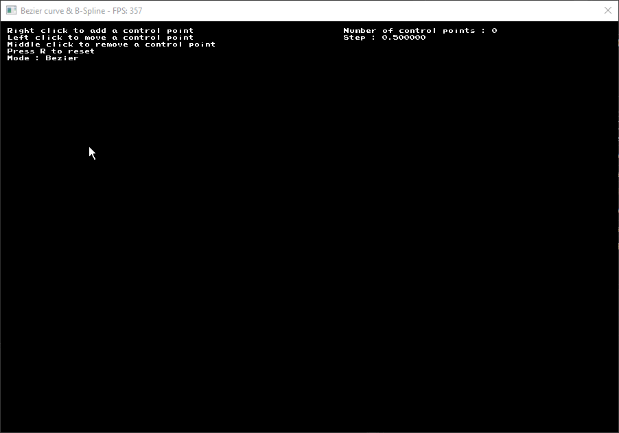

# BezierCurve-BSplines

## Description

Ce projet est une implémentation de courbes de Bézier et de B-Splines en C++ avec la librairie olcPixelGameEngine.

## Commandes

- `Clic gauche` : Déplacer le point sélectionné
- `Clic droit` : Créer un nouveau point
- `Clic molette` : Supprimer le point sélectionné
- `Enter` : Changer de mode (Bézier ou B-Spline)
- `R` : Réinitialiser la courbe
- `->` : Augmenter la précision de la courbe
- `<-` : Diminuer la précision de la courbe

